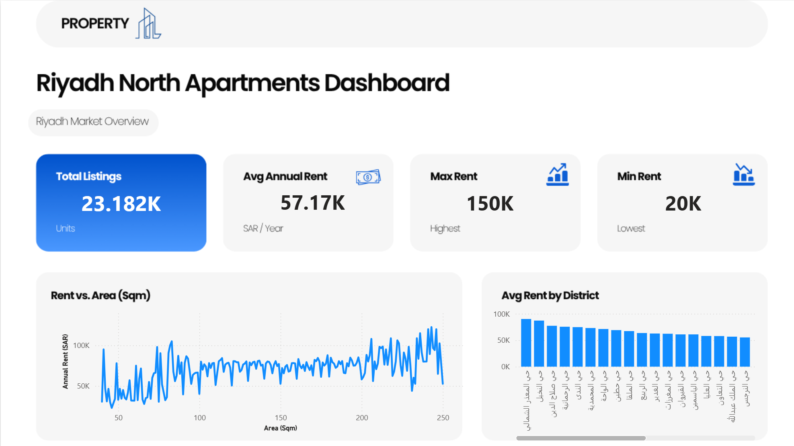

# Riyadh North Apartments Market Analysis

End-to-end data analysis of the apartment rental market in North Riyadh — from raw SQLite data to a cleaned dataset and an interactive Power BI dashboard.



## 📌 Overview

This project analyzes annual apartment rental listings in North Riyadh districts, extracted from a SQLite database, cleaned and processed with Python, and visualized in a Power BI dashboard.

- **Total listings analyzed:** 23,182
- **Average annual rent:** 57.17K SAR
- **Highest rent:** 150K SAR
- **Lowest rent:** 20K SAR

## 🗂️ Data Source

[Saudi Arabia Real Estate Dataset](https://www.kaggle.com/datasets/mohdph/saudi-arabia-real-estate-dataset) — Kaggle

## ⚙️ Methodology

1. **Extraction** — Loaded the SQLite database and queried listings filtered for:
   - City: Riyadh (`الرياض`)
   - Category: rental units
   - Rent period: annual
   - Location path: North Riyadh (`شمال-الرياض`)
2. **Cleaning** — Using `pandas`:
   - Checked for missing values and duplicates
   - Converted Unix timestamps to readable dates
   - Renamed columns to clear English names (`annual_rent_sar`, `area_sqm`, `district_name`, etc.)
3. **Outlier filtering** — Kept listings within realistic bounds:
   - Annual rent between 20,000 and 150,000 SAR
   - Area between 40 and 250 sqm
   - Valid (non-empty) district names
4. **Feature engineering** — Calculated `price_per_sqm` (annual rent ÷ area) for each listing
5. **District-level aggregation** — Excluded districts with fewer than 10 listings to avoid misleading averages from small samples, then computed mean / max / min rent per district
6. **Export** — Saved the final cleaned dataset as `riyadh_north_apartments.csv` for use in Power BI

## 🛠️ Tools Used

- **Python** (Google Colab) — `pandas`, `NumPy`, `sqlite3`
- **Power BI** — interactive dashboard and visualizations

## 📊 Dashboard

The Power BI dashboard includes:
- Key metrics: total listings, average/max/min annual rent
- Rent vs. Area scatter/line trend
- Average rent by district (ranked bar chart)

## 📁 Repository Structure

```
.
├── Riyadh_North_Apartments_Analysis.ipynb   # Data extraction & cleaning notebook
├── riyadh_north_apartments.csv              # Final cleaned dataset
├── dashboard_preview.png                    # Power BI dashboard screenshot
└── README.md
```

## 🚀 How to Run

1. Clone the repo
2. Open `Riyadh_North_Apartments_Analysis.ipynb` in Jupyter or Google Colab
3. Upload the raw dataset (zip/db file) when prompted
4. Run all cells to reproduce the cleaned `riyadh_north_apartments.csv`
5. Load the CSV into Power BI to rebuild the dashboard

## 📬 Contact

Feedback and suggestions are welcome — feel free to open an issue or connect on LinkedIn.

## 📄 License

Data licensed under the original Kaggle dataset's terms. Code in this repository is shared for educational and portfolio purposes.
